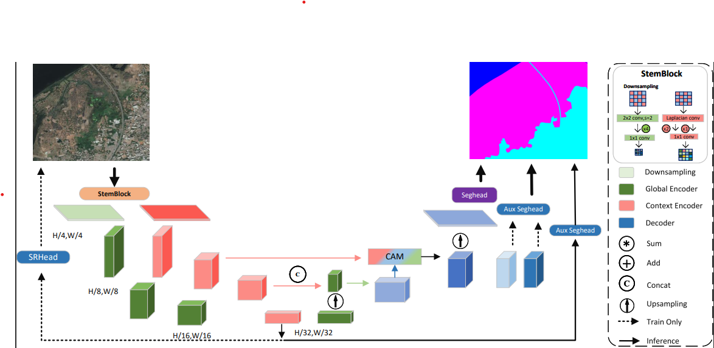

# DE-unet



## Requirements
### conda virtual environment 
```
python=3.8 
pytorch==1.13.0
cuda==11.7 
pip install mmcv-full==1.7.0 -f https://download.openmmlab.com/mmcv/dist/cu117/torch1.13.0/index.html
```
## Datasets
Create folder named 'root_path', its structure is  
```
    aeril_root_path/
    ├── images
       ├── train
          ├── xxx.tif
          ├── ...
       ├── val
       ├── test
    ├── masks
      ├── train
          ├── mask.png(0-num_class)
          ├── ...
      ├── val
      ├── test
```

### Training
`python  tools/train.py   config/path  --work-dir   save/path `
### Evaluation
Accuracy:
`python tools/test.py config_file checkpoints_file   --eval mIoU  `
### Speed
FPS:
`python tools/fps.py config_file   --height /   --width  /`


